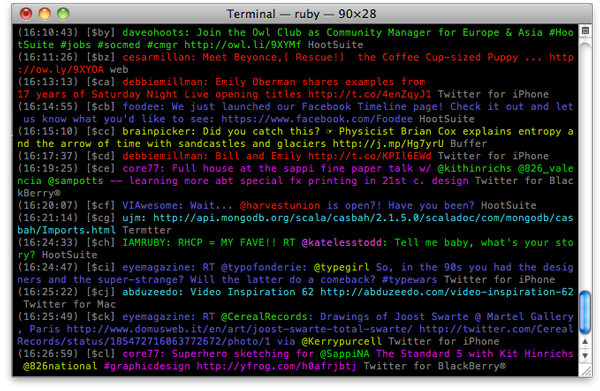

# Home

Termtter is a terminal-based Twitter client.

## Get Started

### Install:

    % gem install termtter

### Run:

    % termtter

## Screenshots

## Documentation

* [Installation](./install)
* [Configuration](./config)
* [Writing Plugins](plugins)

## Source

* [github.com/termtter/termtter](http://github.com/termtter/termtter)

